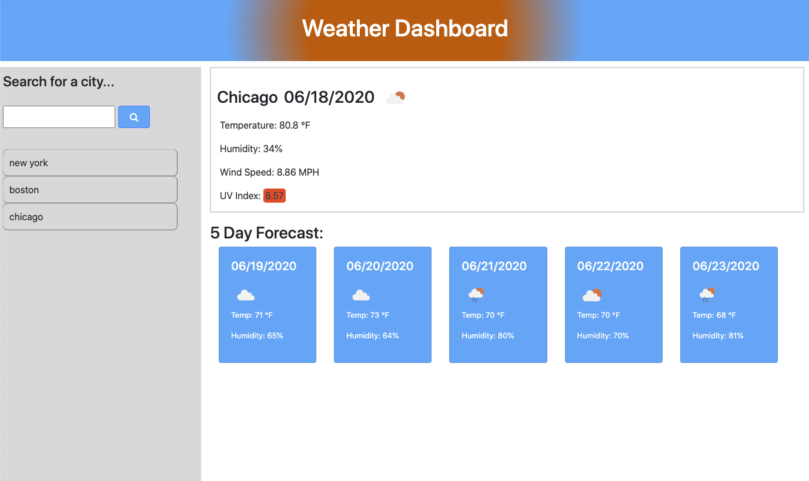

# Weather-app

I created this weather dashboard while getting my Full Stack Development certification from Northwestern University. It is a simple dashboard using the OpenWeather API (https://openweathermap.org/api) that retrieves data for the user's city of choice. 

Once the user has entered their city of choice, they are presented with the current weather for that day, as well as a five day forecast:

Since I was only able to get the UV index by longitude and latitude coordinated, this proved to be the most difficult part. I had to embed this API call within my initial call in order to access this data set:

I also used localStorage to save the users searched cities, and gave them the ability to see each of their weather forecast by clicking on them within the dropdown history:

P.S. I tried to make the header look like a sunset :) enjoy!!

Link to deployed application: https://klynch94.github.io/Weather-app/
